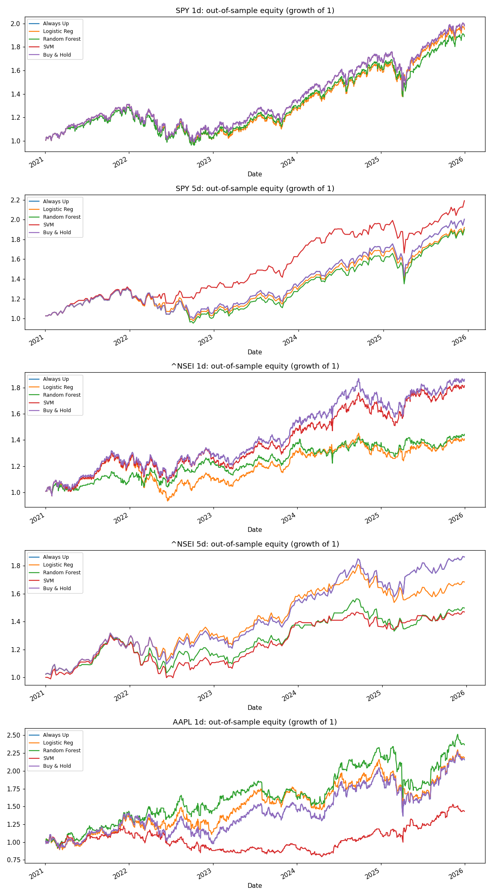
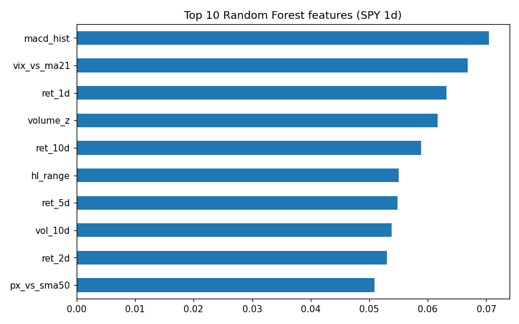

# Machine Learning for Trading

Can machine learning predict whether the stock market will go up or down? This project tests Random Forest and Support Vector Machine (SVM) models on the S&P 500 (SPY), the Nifty 50 and Apple stock, using strict out-of-sample validation, statistical significance tests and robustness checks.

**Main finding:** daily market moves were not predictable, which is consistent with efficient markets. However, an SVM predicting the **weekly** direction of the S&P 500 showed a small but statistically robust edge (AUC ≈ 0.55). It held across two separate test periods and every robustness check, and delivered a higher Sharpe ratio than buy-and-hold, mainly by reducing drawdowns.



---

## Objective

1. **Feature engineering:** extract predictive features from historical market data.
2. **Model selection:** implement Random Forest and SVM classifiers.
3. **Evaluation:** validate on out-of-sample data the models never saw during training or tuning.
4. **Benchmarking:** compare against baseline models and a buy-and-hold strategy.

## Method

**Data.** Daily prices from 2005 to 2025 via Yahoo Finance for SPY, the Nifty 50 (`^NSEI`) and Apple (`AAPL`), plus the VIX volatility index.

**Features (20 per asset).** Every feature on day *t* uses only information available at the close of day *t*, so there is no look-ahead bias.

| Group | Features |
|---|---|
| Momentum | Returns over 1, 2, 3, 5, 10 and 21 days |
| Volatility | Rolling standard deviation over 10, 21 and 63 days |
| Trend | Price relative to its 10, 50 and 200-day moving averages |
| Oscillators | RSI(14), MACD histogram |
| Range and volume | Daily high-low range, 21-day volume z-score |
| Market fear | VIX level, VIX 5-day change, VIX relative to its 21-day average |
| Calendar | Day of week |

For the Nifty 50, the VIX is lagged by one day, because the US market closes after the Indian market.

**Target.** Whether the price will be higher 1 day ahead (daily) or 5 days ahead (weekly).

**Models.**

| Model | Role |
|---|---|
| Always Up | Baseline: predicts "up" every day |
| Logistic Regression | Baseline: simple linear model |
| Random Forest | Main model |
| SVM (RBF kernel) | Main model |

**Validation.**
- Training data: 2005–2020. Test data: 2021–2025, never used for tuning.
- Hyperparameters were tuned with time-series cross-validation (no shuffling, with a gap between folds).
- **Walk-forward testing:** models are retrained every quarter using only past data, then predict the next quarter.
- **Permutation tests** (1,000 shuffles) check whether each model's AUC could have happened by chance.

**Backtest.** The strategy is long when the model predicts "up" and holds cash otherwise, with 5 basis points of transaction cost per trade. Weekly models rebalance every 5 days.

---

## Results

### Experiment summary (test period 2021–2025)

| Experiment | Model | AUC | p-value | Sharpe | Buy & Hold Sharpe | Max Drawdown |
|---|---|---|---|---|---|---|
| SPY daily | Random Forest | 0.512 | 0.246 | 0.84 | 0.89 | -25.3% |
| SPY daily | SVM | 0.512 | 0.248 | 0.89 | 0.89 | -24.5% |
| **SPY weekly** | **SVM** | **0.557** | **0.001** | **1.18** | **0.92** | **-16.5%** |
| SPY weekly | Random Forest | 0.523 | 0.089 | 0.87 | 0.92 | -27.1% |
| Nifty daily | Random Forest | 0.553 | 0.002 | 0.70 | 0.98 | -13.2% |
| Nifty daily | SVM | 0.542 | 0.011 | 0.95 | 0.98 | -17.2% |
| Nifty weekly | SVM | 0.549 | 0.004 | 0.72 | 0.99 | -23.5% |
| Apple daily | Random Forest | 0.488 | 0.753 | 0.83 | 0.69 | -30.6% |
| Apple daily | SVM | 0.496 | 0.624 | 0.44 | 0.69 | -35.3% |

An AUC of 0.5 means random guessing. Full results for every model are in [`results_experiments.txt`](results_experiments.txt).

### Robustness checks

The two strongest results were stress-tested with five harder tests:

| Test | SPY weekly SVM | Nifty daily Random Forest |
|---|---|---|
| Block-permutation significance test (handles overlapping windows) | ✅ p = 0.003 | ✅ p = 0.002 |
| Beats buy-and-hold for every rebalancing start day | ✅ 5 of 5 | ❌ |
| AUC above 0.5 in each year | ✅ 5 of 5 years | ✅ 4 of 5 years |
| Fresh test period 2016–2020 | ✅ AUC 0.554, p = 0.010, Sharpe 1.05 vs 0.92 | ❌ p = 0.056 |
| Works for all hyperparameter settings | ✅ 6 of 6 | ✅ 9 of 9 |
| **Verdict** | **Likely real (5/5)** | **Mixed (3/5)** |

Full output is in [`results_robustness.txt`](results_robustness.txt).

### Feature importance



The MACD histogram and VIX relative to its 21-day average were the most useful features. However, importance is spread fairly evenly, so no single feature dominates.

---

## Key takeaways

1. **Daily prediction failed on SPY and Apple.** The models did no better than "always predict up", which is consistent with the weak-form efficient market hypothesis.
2. **Accuracy is misleading.** Every daily SPY model scored about 55% accuracy, but so did always guessing "up", because markets rise on about 55% of days.
3. **A longer horizon helped.** Weekly SPY prediction produced the only model that was both statistically significant and profitable on a risk-adjusted basis.
4. **The SPY weekly SVM is defensive, not aggressive.** It lost only 1.4% in 2022, when the market fell 17.6%, but earned slightly less than buy-and-hold in strong years. Its advantage is a higher Sharpe ratio and smaller drawdowns.
5. **Signal is not the same as profit.** The Nifty Random Forest predicted direction better than chance, yet a simple invest-or-cash rule could not turn that into more profit than buy-and-hold.
6. **Significance testing matters.** The Apple Random Forest beat buy-and-hold on Sharpe, but its AUC was below 0.5 (p = 0.75), so that outperformance was luck.

## Limitations

- The backtest assumes trades at the closing price with 5 bps costs, and it ignores taxes and slippage.
- An AUC of about 0.55 is a small edge that could weaken as market conditions change.
- The SPY weekly SVM was selected after comparing 15 model and asset combinations. The fresh 2016–2020 test partly addresses this selection bias.
- Only three assets were tested.

---

## How to run

**Easiest option (Google Colab, nothing to install):** download [`ML_for_Trading.ipynb`](ML_for_Trading.ipynb), go to [colab.research.google.com](https://colab.research.google.com), choose **File → Upload notebook**, and run the cells from top to bottom.

**On your own computer:**

```bash
pip install -r requirements.txt
python experiments.py     # runs all 5 experiments (about 10–20 minutes)
python robustness.py      # robustness checks on the best models (about 10–15 minutes)
```

## Files

| File | Description |
|---|---|
| `experiments.py` | Main pipeline: data, features, models, walk-forward testing, backtests, significance tests |
| `robustness.py` | Five robustness checks on the two strongest results |
| `ML_for_Trading.ipynb` | Colab notebook with all code and outputs |
| `results_experiments.txt` | Full output of the experiments |
| `results_robustness.txt` | Full output of the robustness checks |
| `equity_curves_all.png` | Out-of-sample equity curves for every experiment |
| `feature_importance.png` | Top 10 Random Forest features |
| `requirements.txt` | Python libraries needed |

## Tools

Python, pandas, NumPy, scikit-learn, matplotlib, yfinance, Google Colab.

---

*This project is for educational purposes only and is not financial advice.*
